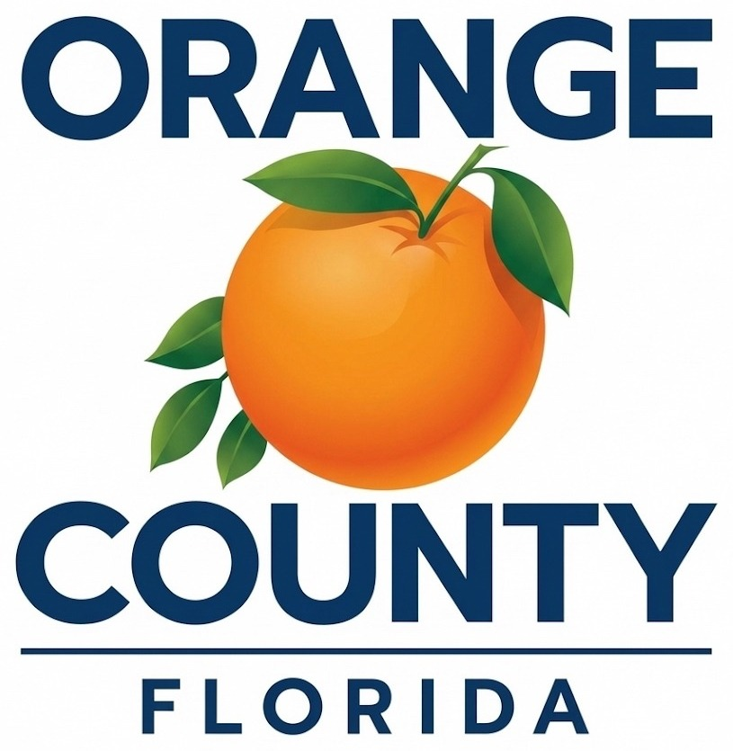

# Handoff prompt — continue upgrading the "Inside ISS" newsletter site

Paste everything below into another LLM to continue the work.

---

You are a senior front-end developer. I'm upgrading a static, single-page HTML/CSS
newsletter site called **"Inside ISS"** for **Orange County Information Systems &
Services (ISS)**. It is hosted on GitHub Pages. Keep it **static HTML/CSS, no
framework, no build step**; only minimal vanilla JS (already used for a mobile menu).
Do not alter factual claims or the stat numbers. Keep the official Orange County
brand system.

## Project structure
```
/index.html
/assets/styles.css
/assets/oc-logo-wide.jpg       (official wide/horizontal OC Florida logo — used in top bar)
/assets/oc-logo-official.jpg   (official vertical OC Florida logo — used in footer)
/assets/oc-pattern.svg         (decorative low-opacity hero background motif)
```

## Brand system (Orange County Florida Brand Guidelines, Jan 2026)
- Primary palette (exact HTML hex): Orange `#EA7603` (PMS 716, reserve mainly for the logo),
  Green `#008540` (PMS 348), Blue `#00629D` (PMS 7691).
- Secondary navy `#00497A` (PMS 7693); top-bar deep navy `#0b2c4d`.
- Fonts: brand primary is Montserrat / body Sofia Pro; the brand's approved web-safe
  fallbacks are **Arial** (headings) and Verdana (body). This file uses Arial/Helvetica.
- LOGO RULE (important): the full-color logo must sit inside a **white box** when placed
  on a colored/dark background or a photo. Both logos here are therefore in white boxes.
  Do not recolor, distort, rearrange, or place the full-color logo on navy without a box.
- AA-safe text tints (for colored text on white): blue `#005285`, green `#0f7a37`,
  orange `#b9560a`.

## What is already done (do not regress these)
- Sticky top bar is **always opaque deep navy `#0b2c4d`** with white content (legible at
  the top, when scrolled over white sections, and on mobile). All bar text passes WCAG AA
  (≥10:1).
- Top bar shows the **official wide logo** (`oc-logo-wide.jpg`) in a white box, enlarged,
  with **no text label** beside it.
- Footer shows the **official vertical logo** (`oc-logo-official.jpg`) in a white box.
- Four in-page nav links → `#inside-iss`, `#iss-news`, `#ai-at-work`, `#cyber-corner`;
  sections have `scroll-margin-top:90px` and `html` has `scroll-padding-top:90px`.
- Mobile hamburger menu (vanilla JS) reveals the four links in a navy dropdown; animates
  to an X; closes on link tap or Escape; toggles `aria-expanded`.
- Duplicate hero stats removed — the `~7,954 hours` / `~$200K` figures appear only once,
  in the "AI at Work" section.
- "Skip to content" link preserved; logical H1→H2→H3 order.

## Open TODOs you may be asked to complete
1. Replace `Edition 1 · [Month Year]` in the top bar with the real edition date
   (search for `<!-- TODO: replace [Month Year] ... -->`).
2. Set the real ISS contact link on the CTA button (`href="#TODO-iss-contact-link"`).
3. Set the real copyright year in the footer (`&copy; [YEAR]`).
4. Optional: the wide logo JPG is low-resolution (243×51). If a higher-res or SVG/PNG
   version is provided, swap `assets/oc-logo-wide.jpg` and update the `` width/height.

## CURRENT index.html
```html
<!doctype html>
<html lang="en">
<head>
  <meta charset="utf-8">
  <meta name="viewport" content="width=device-width, initial-scale=1.0">
  <title>Inside ISS — Orange County Information Systems &amp; Services</title>
  <meta name="description" content="Shareable web edition of the Orange County Information Systems &amp; Services (ISS) newsletter.">
  <link rel="stylesheet" href="assets/styles.css">
</head>
<body id="top">
  <a class="skip" href="#content">Skip to content</a>

  <!-- Sticky top bar with in-page section nav.
       Kept OUTSIDE the hero so position:sticky persists across the whole page. -->
  <div class="iss-topbar" id="topbar">
    <div class="iss-topbar__inner">
      <a class="iss-brand" href="#top" aria-label="Orange County Florida — back to top">
        <!-- Official wide/horizontal OC logo. Full-color logo sits in a white box per
             Brand Guidelines p.10 (required on colored backgrounds). -->
        
      </a>

      <!-- Hamburger toggle (mobile only) -->
      <button class="iss-nav-toggle" id="navToggle" aria-label="Open section menu" aria-expanded="false" aria-controls="primary-nav">
        <span class="iss-nav-toggle__bars" aria-hidden="true"></span>
      </button>

      <nav class="iss-nav" id="primary-nav" aria-label="Newsletter sections">
        <a href="#inside-iss">Inside ISS</a>
        <a href="#iss-news">ISS News</a>
        <a href="#ai-at-work">AI at Work</a>
        <a href="#cyber-corner">Cybersecurity</a>
      </nav>

      <!-- TODO: replace [Month Year] with the real edition date -->
      <span class="iss-edition">Edition 1 · [Month Year]</span>
    </div>
  </div>

  <!-- ============================ HERO ============================ -->
  <header class="iss-hero">
    <div class="iss-hero__inner">
      <div class="iss-hero__lead">
        <p class="iss-eyebrow">Information Systems &amp; Services</p>
        <h1 class="iss-title">Inside ISS</h1>
        <!-- COPY EDIT: tightened from the original; removed the second "work smarter"
             phrasing. Factual content unchanged. -->
        <p class="iss-subtitle">A web edition on how Orange County teams are putting AI to
          work, plus this issue's cybersecurity updates and staff guidance.</p>

        <!-- Hero stats removed: identical figures (~7,954 hours / ~$200K) already appear
             in the "AI at Work" section, so they now display only once there. -->
      </div>

      <!-- Single consistent treatment: solid white card, dark text -->
      <aside class="iss-card" aria-labelledby="edition-heading">
        <h2 class="iss-card__title" id="edition-heading">In this edition</h2>
        <p class="iss-card__body">AI tools supporting smarter County services and 311 staff,
          Procurement time and cost savings, secure remote access updates, software review
          guidance, and approved antivirus reminders.</p>
      </aside>
    </div>
  </header>

  <!-- ============================ MAIN ============================ -->
  <main id="content">
    <div class="wrap">

      <!-- ---------- INSIDE ISS ---------- -->
      <section class="section grid issue-grid" id="inside-iss">
        <article class="card">
          <div class="card-body">
            <p class="tag blue">Inside ISS</p>
            <h2>Welcome to Inside ISS</h2>
            <div class="accent-line"></div>
            <p class="lead">We're introducing a new way to keep Orange County teams informed
              about ISS initiatives, system improvements, and the work happening behind the
              scenes to support daily operations.</p>
            <!-- COPY EDIT: "excited to introduce a new way" -> "introducing a new way" (trims filler). -->
          </div>
        </article>
        <aside class="issue-box" aria-label="Issue overview">
          <p class="tag green">In this issue</p>
          <div class="issue-item">
            <strong>ISS News</strong>
            <span>AI tools supporting smarter County services and 311 staff.</span>
          </div>
          <div class="issue-item">
            <strong>Cybersecurity Corner</strong>
            <span>Secure remote access, software review, and antivirus reminders.</span>
          </div>
        </aside>
      </section>

      <!-- ---------- ISS NEWS ---------- -->
      <section class="section card" id="iss-news">
        <div class="card-body">
          <p class="tag blue">ISS News</p>
          <h2>What's New &amp; Improved</h2>
          <div class="accent-line"></div>

          <h3>Using AI to Support Smarter County Services</h3>
          <p>Orange County is finding new ways to use artificial intelligence (AI) to improve
            daily operations and make services more convenient for residents and employees.
            Across multiple departments, AI tools help staff manage routine tasks in procurement,
            finance, information technology, document review, compliance, cybersecurity, software
            development, and employee support.</p>
          <!-- COPY EDIT: "are helping staff manage" -> "help staff manage" (tighter). -->
          <p>These tools save time, cut repetitive work, and improve accuracy, letting employees
            focus more on serving the community. Residents are already seeing faster response
            times and easier access to County services and information.</p>
          <!-- COPY EDIT: collapsed "help save time, reduce repetitive work, improve accuracy,
               and increase efficiency" -> "save time, cut repetitive work, and improve accuracy"
               (removes the redundant "increase efficiency"). No claims changed. -->
          <p>County leaders say AI is being introduced carefully to support employees while
            following County policies and maintaining appropriate technology safeguards.</p>

          <h3 style="margin-top:1.75rem;">Helping Staff Find Answers Faster with Custom GPT</h3>
          <p>Orange County is using a Custom GPT tool to help 311 staff quickly find accurate
            information across County services and better assist residents with questions and
            resource navigation.</p>
          <p>The tool reduces time spent searching by giving faster, more consistent responses
            during daily interactions and high call volumes. Staff can quickly pull up service
            details, program information, and County resources, cutting manual lookups.</p>
          <!-- COPY EDIT: trimmed "helping improve response efficiency and reduce manual lookup
               efforts" -> "cutting manual lookups" (the efficiency point is already stated). -->
          <p>Early feedback shows the tool is improving response speed and consistency while
            helping staff deliver accurate information to residents. It is part of the County's
            broader approach to using AI responsibly to improve service quality and support
            employees in their daily work.</p>
          <!-- COPY EDIT: "The effort is part of" -> "It is part of" (concise). -->
        </div>
      </section>

      <!-- ---------- AI AT WORK ---------- -->
      <section class="section grid two-col" id="ai-at-work">
        <article class="card">
          <div class="card-body">
            <p class="tag orange">AI at Work</p>
            <h2>Exploring Smarter Ways to Work</h2>
            <div class="accent-line"></div>
            <h3>AI Helping Teams Work Faster</h3>
            <!-- COPY EDIT: heading "Work Smarter and Faster" -> "Work Faster"
                 ("smarter" already appears in the section title above). -->
            <p>Orange County's Procurement Division is using AI tools to streamline daily
              operations and support employees managing heavy workloads. AI assists with invoice
              processing, contract reviews, workload assignments, change orders, and Statements of
              Work (SOWs), while improving compliance and document quality.</p>
            <p>The technology is already in use as part of the County's broader AI initiative.
              Current estimates show these tools save approximately 7,954 work hours and nearly
              $200,000 annually while improving consistency, reducing delays, and helping teams
              manage growing workloads.</p>
            <!-- Stat numbers preserved exactly: ~7,954 hours and ~$200,000. -->
            <div class="stats" aria-label="Procurement impact stats">
              <div class="stat green">
                <div class="num">~7,954</div>
                <div class="label">Work hours saved annually</div>
              </div>
              <div class="stat orange">
                <div class="num">~$200K</div>
                <div class="label">Estimated savings annually</div>
              </div>
            </div>
          </div>
        </article>

        <aside class="tip" aria-label="Cybersecurity quick tip">
          <p class="tag orange">Quick Tip</p>
          <h3>Protect Your Devices with County Antivirus</h3>
          <p>Orange County employees can use Sophos antivirus for approved home use with their
            @ocfl.net email account. Sophos helps protect devices from malware, ransomware, and
            phishing while supporting secure remote work.</p>
          <ul class="list">
            <li>Installation instructions and resources are on the internal ISS portal using your
              County login credentials.</li>
            <li>Contractors and interns may have different access permissions and should contact
              ISS for assistance.</li>
          </ul>
          <p style="margin-top:1rem;"><strong style="color:var(--oc-navy-900);">Important:</strong>
            Using approved antivirus on home devices helps protect County systems and reduces
            cybersecurity risks.</p>
        </aside>
      </section>

      <!-- ---------- CYBERSECURITY CORNER ---------- -->
      <section class="section card" id="cyber-corner">
        <div class="card-body">
          <p class="tag green">Cybersecurity Corner</p>
          <h2>Stay Safe &amp; Informed</h2>
          <div class="accent-line"></div>

          <h3>Secure Remote Access Starts with Safe Connections</h3>
          <p>Orange County continues improving remote access tools so employees can work securely
            from different locations. Updated virtual private network (VPN) technology strengthens
            security, improves connection reliability, and gives staff a smoother experience when
            accessing County systems remotely.</p>
          <p>Ongoing work focuses on usability, reliability, and cost efficiency while helping
            protect County networks and information during remote work.</p>
          <!-- COPY EDIT: "Ongoing improvements focus on" -> "Ongoing work focuses on"
               (avoids repeating "improving/improvements" from the line above). -->

          <h3 style="margin-top:1.75rem;">Before Purchasing Software, Start with ISS</h3>
          <p>All software requests must go through ISS for review and approval before any purchase.
            Employees should work with their ISS project lead or submit a request through the formal
            intake process so security, compliance, and compatibility requirements are met.</p>
          <p>Following the process reduces security risks, avoids duplicate tools and unnecessary
            spending, and supports County AI and IT governance standards while helping departments
            make informed technology decisions.</p>
        </div>
      </section>

      <!-- ---------- CTA ---------- -->
      <section class="cta" aria-label="Contact ISS">
        <div class="wrap" style="padding:0; max-width:760px;">
          <div class="eyebrow-cta">Get Involved</div>
          <div class="cta-head">Have a story idea? Reach out to the ISS team.</div>
          <!-- TODO: real ISS contact link (mailto: or portal URL) -->
          <a class="button" href="#TODO-iss-contact-link" target="_blank" rel="noopener noreferrer">Contact the ISS Team</a>
        </div>
      </section>

      <!-- ---------- FOOTER ---------- -->
      <footer>
        <!-- Official Orange County Florida vertical logo (user-supplied), placed inside a
             white box per Brand Guidelines p.10 (full-color logo on colored backgrounds). -->
        <span style="display:inline-block;background:#fff;padding:16px 20px;border-radius:10px;margin-bottom:14px;">
          
        </span>
        <p style="font-size:1.1rem; color:#fff; font-weight:bold;">Orange County Information Systems &amp; Services (ISS)</p>
        <p>Supporting Orange County through technology, innovation, and service.</p>
        <p class="meta">Orange County, Florida · Est. 1845</p>
        <!-- TODO: confirm current copyright year -->
        <p>&copy; [YEAR] Orange County Government. All rights reserved.</p>
        <p><a href="https://www.ocfl.net/" target="_blank" rel="noopener noreferrer">www.ocfl.net</a></p>
      </footer>

    </div>
  </main>

  <!-- Minimal vanilla JS: mobile hamburger menu toggle. The bar itself is always
       opaque navy via CSS, so no scroll listener is needed for legibility. -->
  <script>
    (function () {
      var toggle = document.getElementById('navToggle');
      var nav = document.getElementById('primary-nav');
      var bar = document.getElementById('topbar');
      if (!toggle || !nav || !bar) return;

      function setOpen(open) {
        bar.classList.toggle('nav-open', open);
        toggle.setAttribute('aria-expanded', open ? 'true' : 'false');
        toggle.setAttribute('aria-label', open ? 'Close section menu' : 'Open section menu');
      }
      toggle.addEventListener('click', function () {
        setOpen(toggle.getAttribute('aria-expanded') !== 'true');
      });
      // Close the menu after tapping a link
      nav.addEventListener('click', function (e) {
        if (e.target.tagName === 'A') { setOpen(false); }
      });
      // Close on Escape
      document.addEventListener('keydown', function (e) {
        if (e.key === 'Escape') { setOpen(false); }
      });
    })();
  </script>
</body>
</html>
```

## CURRENT assets/styles.css
```css
/* ============================================================
   Inside ISS — Orange County Information Systems & Services
   Static newsletter stylesheet (no build step, no framework).
   ============================================================ */

:root{
  /* ---- OFFICIAL OCFL BRAND PALETTE (from Brand Guidelines, Jan 2026) ---- */
  /* Primary palette: exact HTML values from the guide */
  --oc-orange:#EA7603;       /* PMS 716  - reserved primarily for the logo */
  --oc-green:#008540;        /* PMS 348 */
  --oc-blue:#00629D;         /* PMS 7691 - primary brand blue */
  /* Secondary palette (used for depth / neutrals) */
  --oc-navy-900:#00497A;     /* PMS 7693 - dark navy */
  --oc-navy-700:#006B93;     /* PMS 7706 - mid teal-blue */
  --oc-bar:#0b2c4d;          /* deep navy for the sticky top bar (per request; reads as part of the dark hero) */
  --oc-cream:#FAF7EF;        /* neutral supporting cream */

  /* ---- AA-safe text tints (derived; used only for text on white) ---- */
  --oc-blue-700:#005285;     /* AA blue text on white */
  --oc-green-700:#0f7a37;    /* AA green text on white */
  --oc-orange-700:#b9560a;   /* AA orange text on white */
  --oc-green-bright:#7ac143; /* decorative only */

  --oc-ink:#1a2433;
  --oc-paper:#ffffff;
  --oc-bg:#eef3f6;
  --oc-border:#d8e1e8;
  --oc-shadow:0 18px 50px rgba(0,50,85,.12);
  --radius:18px;
  --radius-sm:14px;
  --wrap:1080px;
}

*{box-sizing:border-box;}
html{scroll-behavior:smooth;scroll-padding-top:90px;}
body{
  margin:0;
  font-family:Arial, Helvetica, sans-serif;
  color:var(--oc-ink);
  background:linear-gradient(180deg,#f5f8fb 0%,#edf3f7 100%);
  line-height:1.6;
}
a{color:var(--oc-blue-700);}

.wrap{max-width:var(--wrap);margin:0 auto;padding:0 1.5rem;}

/* Skip link */
.skip{position:absolute;left:-9999px;top:auto;}
.skip:focus{left:16px;top:16px;background:#fff;color:var(--oc-navy-900);
  padding:10px 14px;border-radius:8px;z-index:60;font-weight:700;}

/* ---------- HERO ---------- */
.iss-hero{
  position:relative;color:#fff;overflow:hidden;
  background:
    radial-gradient(1200px 500px at 80% -10%, rgba(31,111,192,.45), transparent 60%),
    linear-gradient(160deg, var(--oc-navy-900), var(--oc-navy-700));
}
.iss-hero::after{
  content:"";position:absolute;inset:0;
  background:url("oc-pattern.svg") center/360px repeat;
  opacity:.06;pointer-events:none;
}

/* ---------- Sticky top bar / nav ----------
   Always-opaque deep navy so the bar is legible at the top, when scrolled
   over light content, and on mobile. White text throughout. */
.iss-topbar{
  position:sticky;top:0;z-index:50;
  background:var(--oc-bar);
  box-shadow:0 4px 18px rgba(0,0,0,.25);
}
/* Inner content constrained to page width; bar background spans full width */
.iss-topbar__inner{
  display:flex;align-items:center;gap:1.25rem;
  max-width:var(--wrap);margin:0 auto;padding:.6rem 1.5rem;
}

/* Brand: official wide logo in a white box (brand rule: full-color logo needs a white box
   on colored backgrounds). Enlarged per request; no text label beside it. */
.iss-brand{display:inline-flex;align-items:center;flex:0 0 auto;
  background:#fff;border-radius:10px;padding:8px 14px;line-height:0;
  text-decoration:none;box-shadow:0 2px 8px rgba(0,0,0,.18);}
.iss-brand:focus-visible{outline:2px solid var(--oc-orange);outline-offset:3px;}
.iss-logo{display:block;width:auto;height:46px;}

.iss-nav{display:flex;gap:1.1rem;margin-left:auto;align-items:center;}
.iss-nav a{
  color:rgba(255,255,255,.85);text-decoration:none;font-size:.9rem;
  font-weight:600;white-space:nowrap;padding-bottom:3px;border-bottom:2px solid transparent;
}
.iss-nav a:hover,.iss-nav a:focus-visible{color:#fff;border-bottom-color:var(--oc-orange);}
.iss-nav a:focus-visible{outline:2px solid var(--oc-orange);outline-offset:4px;border-radius:3px;}

.iss-edition{color:rgba(255,255,255,.85);font-size:.82rem;letter-spacing:.03em;
  white-space:nowrap;margin-left:1.25rem;flex:0 0 auto;}

/* Hamburger toggle: hidden on desktop, shown on mobile */
.iss-nav-toggle{
  display:none;margin-left:auto;width:42px;height:42px;padding:0;
  background:transparent;border:1px solid rgba(255,255,255,.35);border-radius:8px;
  cursor:pointer;align-items:center;justify-content:center;
}
.iss-nav-toggle:focus-visible{outline:2px solid var(--oc-orange);outline-offset:2px;}
.iss-nav-toggle__bars,
.iss-nav-toggle__bars::before,
.iss-nav-toggle__bars::after{
  content:"";display:block;width:20px;height:2px;background:#fff;border-radius:2px;
  transition:transform .2s ease, opacity .2s ease;
}
.iss-nav-toggle__bars{position:relative;}
.iss-nav-toggle__bars::before{position:absolute;top:-6px;left:0;}
.iss-nav-toggle__bars::after{position:absolute;top:6px;left:0;}
/* Animate to an X when open */
.nav-open .iss-nav-toggle__bars{background:transparent;}
.nav-open .iss-nav-toggle__bars::before{transform:translateY(6px) rotate(45deg);}
.nav-open .iss-nav-toggle__bars::after{transform:translateY(-6px) rotate(-45deg);}

.iss-hero__inner{
  position:relative;z-index:1;display:grid;
  grid-template-columns:1.4fr 1fr;gap:3rem;align-items:center;
  max-width:var(--wrap);margin:0 auto;padding:3rem 1.5rem 3.5rem;
}
.iss-eyebrow{
  text-transform:uppercase;letter-spacing:.16em;font-size:.8rem;font-weight:700;
  color:rgba(255,255,255,.92);margin:0 0 .75rem;
}
.iss-title{font-size:clamp(2.75rem,6vw,4.5rem);line-height:1.02;margin:0 0 1rem;font-weight:800;}
.iss-subtitle{font-size:1.15rem;line-height:1.6;max-width:38ch;
  color:rgba(255,255,255,.95);margin:0;}
/* Hero stats block intentionally removed (duplicate of AI at Work stats). */

/* Solid white "In this edition" card (single consistent treatment) */
.iss-card{
  background:var(--oc-paper);color:var(--oc-ink);border-radius:16px;padding:1.75rem;
  box-shadow:0 18px 40px -12px rgba(0,0,0,.45);border-top:4px solid var(--oc-orange);
}
.iss-card__title{margin:0 0 .75rem;font-size:1.25rem;font-weight:700;color:var(--oc-navy-900);}
.iss-card__body{margin:0;line-height:1.6;font-size:1rem;color:var(--oc-ink);}

/* ---------- MAIN ---------- */
main{padding:2.25rem 0 4.5rem;}
.section{margin-bottom:1.6rem;scroll-margin-top:90px;}
.grid{display:grid;gap:1.5rem;}
.issue-grid{grid-template-columns:1fr 1fr;}
.two-col{grid-template-columns:1.1fr .9fr;}

.card{
  background:var(--oc-paper);border:1px solid var(--oc-border);border-radius:var(--radius);
  box-shadow:var(--oc-shadow);overflow:hidden;
}
.card-body{padding:1.75rem;}

.tag{display:inline-flex;align-items:center;gap:.6rem;font-size:.72rem;font-weight:700;
  text-transform:uppercase;letter-spacing:.14em;margin-bottom:.6rem;}
.tag::before{content:"";width:12px;height:12px;background:currentColor;display:inline-block;border-radius:3px;}
.tag.blue{color:var(--oc-blue-700);}
.tag.green{color:var(--oc-green-700);}
.tag.orange{color:var(--oc-orange-700);}

h2{margin:0 0 .6rem;color:#111;font-size:2rem;line-height:1.1;}
h3{margin:0 0 .6rem;color:var(--oc-navy-900);font-size:1.5rem;line-height:1.2;}
p{margin:0 0 .9rem;font-size:1.06rem;}
.lead{font-size:1.18rem;}
.accent-line{width:68px;height:5px;background:var(--oc-orange);border-radius:999px;margin:.85rem 0 1.35rem;}

.issue-box{background:var(--oc-cream);border:1px solid #ece5d6;border-top:5px solid var(--oc-green);
  border-radius:var(--radius-sm);padding:1.4rem;}
.issue-item{padding:.85rem 0;border-top:1px solid #e8dcc6;}
.issue-item:first-of-type{border-top:0;padding-top:0;}
.issue-item strong{display:block;color:#111;margin-bottom:.25rem;}

ul.list{margin:.6rem 0 0 0;padding-left:1.4rem;}
ul.list li{margin-bottom:.6rem;font-size:1.06rem;}

.tip{background:var(--oc-cream);border:1px solid #ece5d6;border-top:5px solid var(--oc-orange);
  border-radius:var(--radius-sm);padding:1.5rem;}

/* Mid-page stat boxes (AI at Work) */
.stats{display:grid;grid-template-columns:1fr 1fr;gap:1rem;margin-top:1.5rem;}
.stat{background:var(--oc-cream);border-radius:14px;padding:1.4rem;text-align:center;
  border:1px solid #dde7dd;border-top:5px solid var(--oc-green);}
.stat.orange{border-top-color:var(--oc-orange);border-color:#efe1cf;border-top-color:var(--oc-orange);}
.stat .num{font-size:2.4rem;line-height:1;font-weight:800;letter-spacing:-.03em;margin-bottom:.4rem;}
.stat.green .num{color:var(--oc-green-700);}
.stat.orange .num{color:#a64f09;} /* AA on cream background */
.stat .label{font-size:.72rem;line-height:1.4;letter-spacing:.1em;text-transform:uppercase;color:#5a5a5a;font-weight:700;}
@media (max-width:560px){ .stats{grid-template-columns:1fr;} }

/* CTA band */
.cta{
  background:linear-gradient(180deg,#b1570a 0%, #9c4d0a 100%); /* AA: white text >=4.5:1 across the gradient */
  color:#fff;text-align:center;padding:2.2rem 1.75rem;border-radius:var(--radius);box-shadow:var(--oc-shadow);
}
.cta .eyebrow-cta{font-size:.75rem;font-weight:700;text-transform:uppercase;letter-spacing:.16em;margin-bottom:.5rem;}
.cta .cta-head{font-size:2rem;line-height:1.15;font-weight:800;margin-bottom:.75rem;}
.cta a.button{
  display:inline-block;margin-top:.4rem;background:#fff;color:var(--oc-navy-900);text-decoration:none;
  font-weight:700;text-transform:uppercase;letter-spacing:.06em;padding:.85rem 1.4rem;border-radius:999px;
}
.cta a.button:hover,.cta a.button:focus-visible{background:#f1f1f1;}

/* Footer */
footer{margin-top:2rem;background:var(--oc-navy-900);color:#e8f1f9;border-radius:var(--radius);padding:1.75rem;}
footer p{font-size:.97rem;margin-bottom:.5rem;}
footer a{color:#fff;}
.meta{color:#bcd9ee;font-size:.78rem;letter-spacing:.12em;text-transform:uppercase;font-weight:700;}

/* ---------- RESPONSIVE ---------- */
@media (max-width:820px){
  .iss-hero__inner{grid-template-columns:1fr;gap:2rem;padding-top:1.75rem;}
  .issue-grid,.two-col{grid-template-columns:1fr;}

  /* Top bar: brand + logo stay visible; edition hidden; hamburger appears */
  .iss-edition{display:none;}
  .iss-nav-toggle{display:inline-flex;}

  /* Collapse the nav into a dropdown panel revealed by the hamburger.
     Background is the same opaque navy so links are always legible. */
  .iss-nav{
    position:absolute;left:0;right:0;top:100%;
    flex-direction:column;align-items:stretch;gap:0;
    margin-left:0;
    background:var(--oc-bar);
    box-shadow:0 12px 24px rgba(0,0,0,.3);
    border-top:1px solid rgba(255,255,255,.12);
    max-height:0;overflow:hidden;
    transition:max-height .25s ease;
  }
  .nav-open .iss-nav{max-height:320px;}
  .iss-nav a{
    padding:.95rem 1.5rem;border-bottom:2px solid transparent;
    border-top:1px solid rgba(255,255,255,.08);
    color:#fff;font-size:1rem;
  }
  .iss-nav a:first-child{border-top:0;}
  .iss-nav a:hover,.iss-nav a:focus-visible{border-bottom-color:transparent;border-left:3px solid var(--oc-orange);padding-left:calc(1.5rem - 3px);}
  /* Anchor the dropdown to the bar */
  .iss-topbar{position:sticky;}
  .iss-topbar__inner{position:relative;}
}
@media (max-width:560px){
  h2{font-size:1.6rem;}
  h3{font-size:1.3rem;}
  .cta .cta-head{font-size:1.6rem;}
  .card-body,.tip,.issue-box,footer,.iss-card{padding:1.4rem;}
}

/* Reduced motion */
@media (prefers-reduced-motion:reduce){
  html{scroll-behavior:auto;}
  .iss-nav,.iss-nav-toggle__bars,
  .iss-nav-toggle__bars::before,.iss-nav-toggle__bars::after{transition:none;}
}
```

## Notes about assets
- `oc-logo-wide.jpg` and `oc-logo-official.jpg` are the official Orange County Florida
  logos (provided by the County). Treat them as canonical; do not redraw them.
- `oc-pattern.svg` is a decorative circuit/geometric motif rendered at ~6% opacity behind
  the hero text — purely decorative (no alt text needed).

When you make changes, return the full updated `index.html` and `assets/styles.css`, keep
everything static (no framework/build), preserve the brand rules and accessibility, and
note any WCAG AA contrast values you change.
